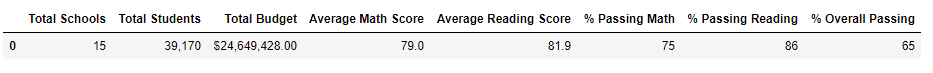
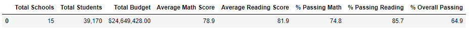
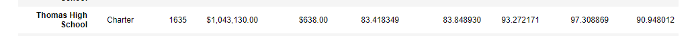
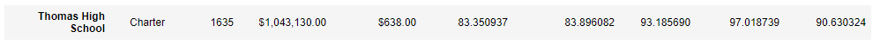
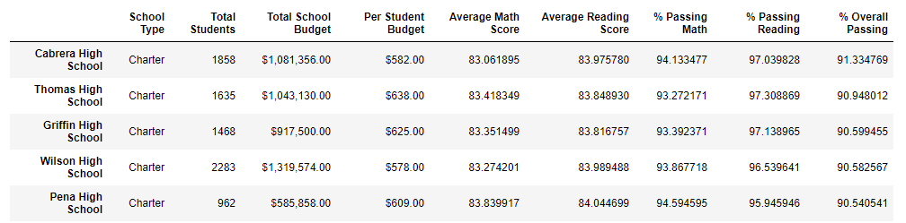
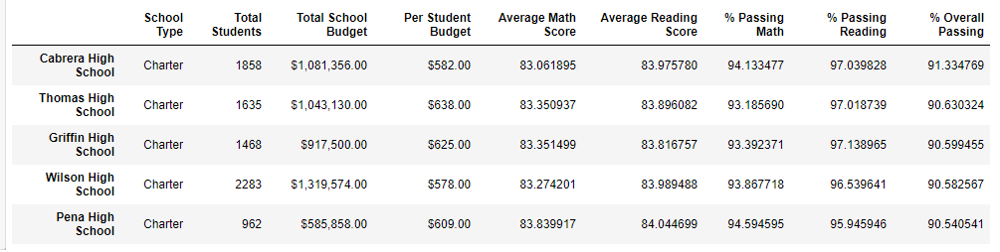

# School_District_Analysis

## Overview
The school board has notified Maria and her supervisor that the "students_complete.csv" file shows evidence of academic dishonesty. as a result, the reading and math grades for Thomas High School ninth graders score will be omitted. The purpose of this analysis is to compare the result of the data frame before and after the omission of the reading and math grades for Thomas High School ninth graders score. To perform this analysis, "students.complete.csv" and "schools_complete.csv" were analyzed via PythonData in Jupyter Notebooks.

## Results

### How is the district summary affected?
*Before*

*After*

- The average math score went down by 0.1
- The average reading score stayed the same.
- The passing math percentage went down by 0.2%.
- The passing reading percentage went down by 0.3%.
- The overall passing percentage went down by 0.1%.

### How is the school summary affected?
*Before*

*After*

- The average math score went down by 0.1.
- The average reading score went up by 0.1.
- The passing math percentage went down by 0.1%.
- The passing reading percentage went down by 0.3%.
- The overall passing percentage went down by 0.3%.

### How does replacing the ninth graders’ math and reading scores affect Thomas High School’s performance relative to the other schools?
*Before*

*After*

Even with replacing the ninth grader's math and reading scores, Thomas High School's performance is still the second top school relatively to other schools.

### How does replacing the ninth-grade scores affect the following:
- Math and reading scores by grade
- Scores by school spending
- Scores by school size
- Scores by school type

## Summary
Summary: Summarize four major changes in the updated school district analysis after reading and math scores for the ninth grade at Thomas High School have been replaced with NaNs.
